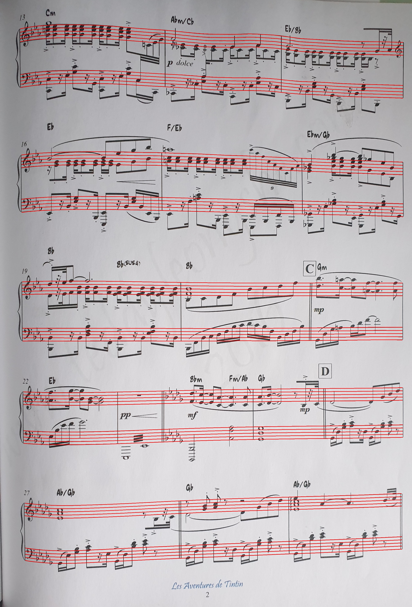
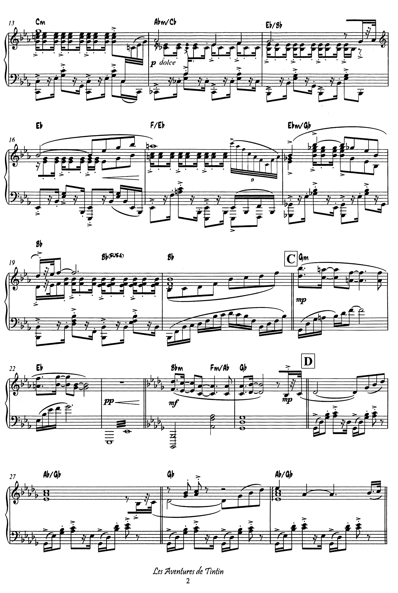

# Rectification of Musical Documents

This project introduces a novel approach to the rectification of musical documents to enhance the usability and accuracy
of Optical Music Recognition (OMR) systems. Common Western Music Notation (CWMN) relies heavily on the precise positioning
of visual symbols on a musical staff to encode pitch and rhythm. However, input images—often derived from photographs of
book pages or standalone sheets—frequently suffer from distortions such as page curl and projective foreshortening, which
degrade the performance of subsequent detection steps.  
Rectifying these distortions requires knowledge about the 3D shape of the page, which is challenging to infer from a single
image. Indeed, 3D reconstruction from a single image is an under-constrained problem that cannot be solved without incorporating
additional assumptions or prior knowledge. As a result, general document rectification methods often rely on restrictive
assumptions about the page shape or require multiple images or 3D scans.  
Musical documents, however, possess significant structural information due to the presence of parallel staff lines, which
can be exploited to address these challenges specifically for the domain of musical documents.

This project leverages this structural information to perform both
**geometric** and **photometric** rectification of musical documents from a single image, without assuming a specific page
shape other than it being a smooth, developable surface. The rectification process is enabled by a novel staff detection
algorithm that identifies staffs across the page with sub-pixel precision, providing the necessary baseline data to
accurately model the page's geometry and correct its distortions.




## Project Overview

The problem of rectifying a musical document is broken down into several stages:
- **Line Model**: Establish global parameters about the page like contrast, average line thickness and interline staff space (ISS).
- **Steger Point Detection**: Based on [this research paper](https://ieeexplore.ieee.org/abstract/document/659930), detect positions and orientations of line segments that match the thickness of staff lines.
- **Staff Detection**: Assemble line segments into staffs by using a novel clustering algorithm, called **Momentum Clustering**. This algorithm is tailored to the problem of tracking curved lines and uses positions as well as orientations for a stable clustering process. This stage produces spline-based models that describe the position of staffs in the image with sub-pixel precision.
- **Longitude Detection**: Using Radial Basis Field (RBF) interpolation on vertical line segments from stems and barlines, establish longitudinal isolines.
- **Surface Reconstruction**: Combine directrices (staffs) and longitudes into a grid and calculate the 3D surface from these vertices using a numerical procedure described in [this paper](https://ieeexplore.ieee.org/abstract/document/5995540/).
- **Rectifiaction**: Establish spacing of isolines based on scale and perform remapping of image (geometric rectification). This makes curved lines become straight.
- **Lighting Correction**: Maximize contrast between foreground and background of the image using a custom algorithm. This algorithm can be thought of as an extension of adaptive thresholding, operating in the grayscale rather than binary domain.

For a detailed description of the different algorithms and stages, refer to the detailed [technical report](docs/Rectification_of_Curved_Musical_Documents.pdf).

## Results / Usage

The results of the pipeline on a small dataset can be inspected by inspecting the `results` folder, which contains the
rectified images. The sub-folder `staff_detection` showcases the detected staff lines overlayed onto the original images.

Alternatively, the pipeline can be run on the dataset or custom images by running the main method of the 
`DocumentRectification` class. 


### Prerequisites

This project relies on **openCV** (.jar included in the project) for image related tasks.
Make sure you have set up proper loading of openCV in DocumentRectifications' run configuration (instructions
provided in class code).

The project also relies on [ArpackJ](https://github.com/Daniel63656/ArpackJ)
to efficiently solve the 3D reconstruction problem, which is imported
via the mavenLocal directory. To obtain ArpackJ as a local library, follow these steps:

1. Clone the ArpackJ repository:
    ```bash
    git clone https://github.com/Daniel63656/ArpackJ.git
    ```

2. Navigate to the project directory and run the publishToMavenLocal gradle task:
    ```bash
    cd ArpackJ
    ./gradlew publishToMavenLocal
    ```
